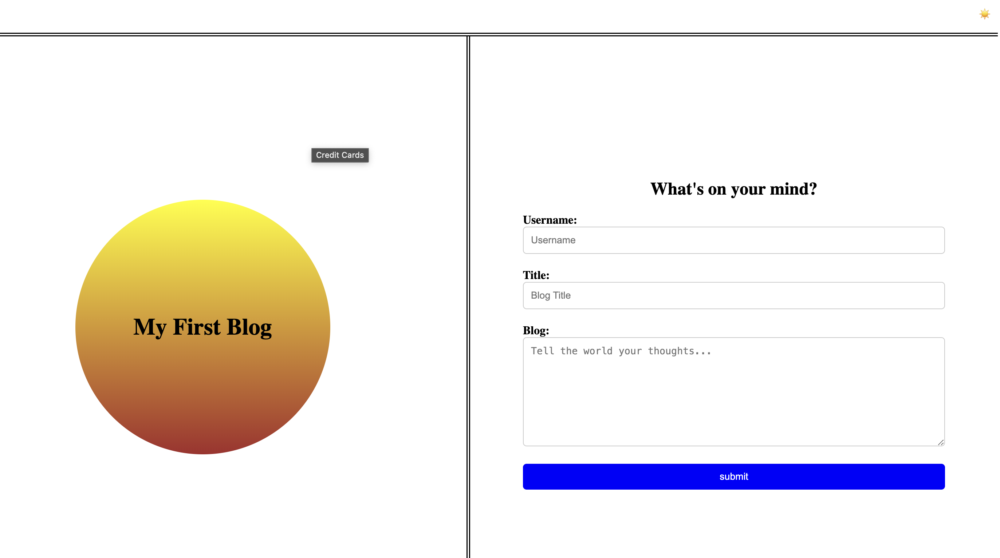
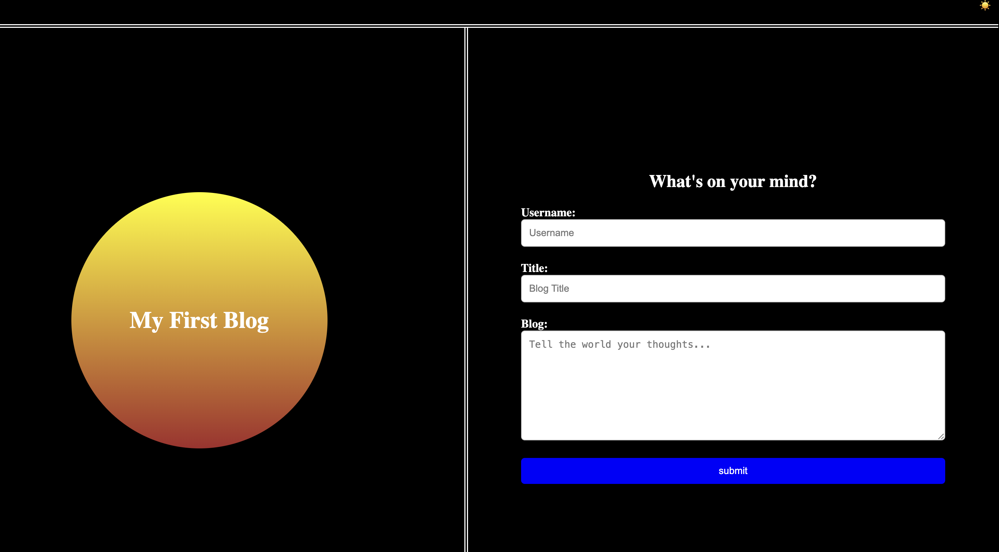
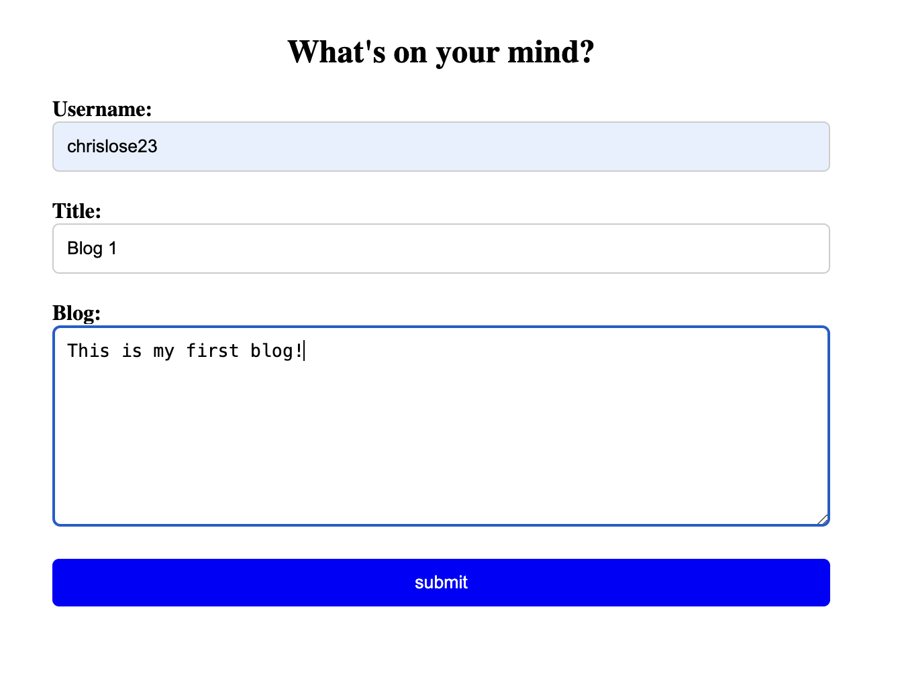
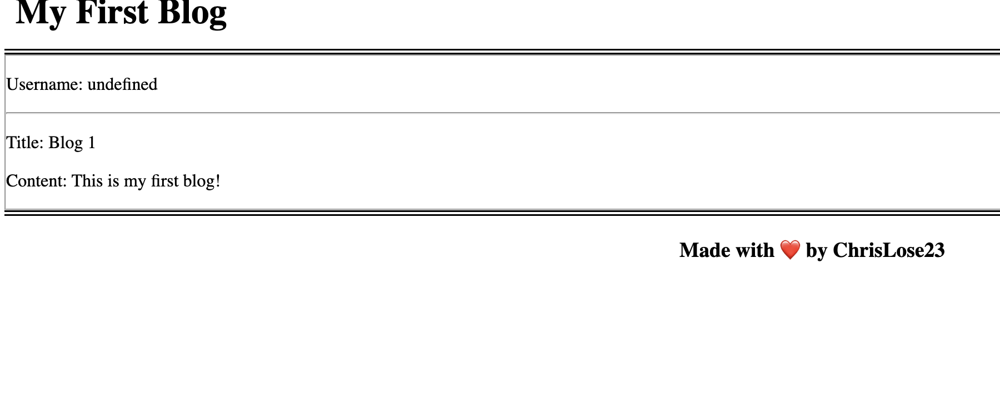
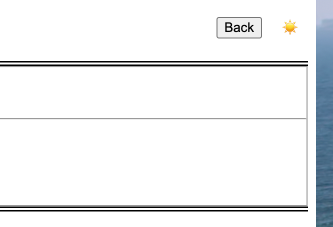
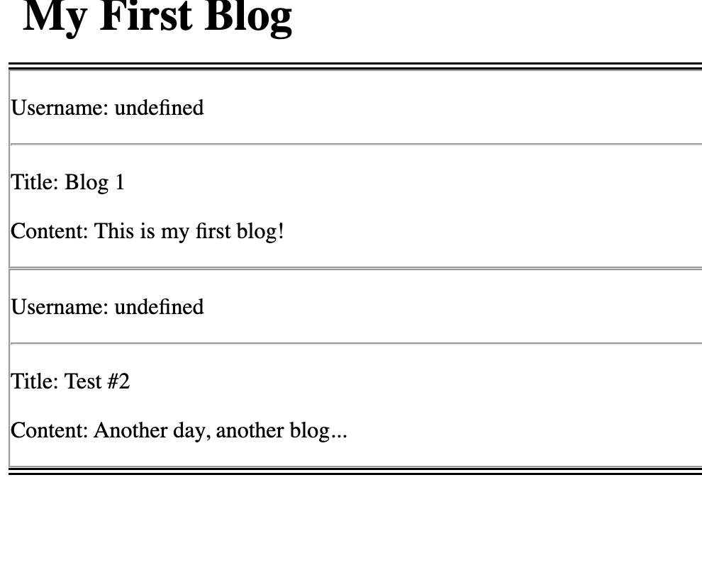

# 04-Challenge - Create a blog

## Description

For this weeks challenge, I created a 2 page blog site that resembles the example. This app uses html, css, and javascript as well as some jQuery. The app adjusts its view depending on screen size and comes with a light and dark mode option.

## Usage

When the app loads up, the user can enter information about their blog into the form on the right.

There is a dark mode option in the top right that when clicked will switch the view to dark mode.

Once the blog information is entered in the form, click submit to post your blog!

The user will be directed to the blog post page and their blog will be displayed.

Click the back button to return to the main page.

Any additional blogs will show up as you post them.

## Credits

While creating this app, I used references from W3Schools to guide me with my code. This was helpful getting through problems and allowed me to customize my app the way I wanted.

## License

Thids app used a MIT license

